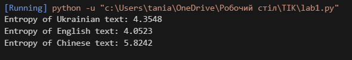
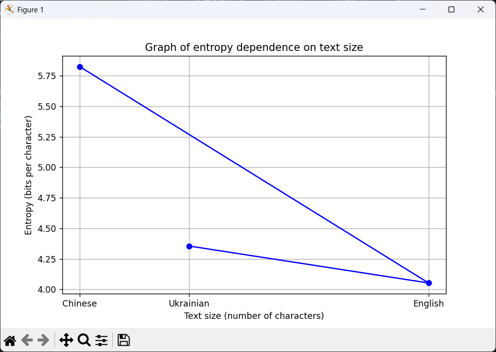

1. Мета роботи

Метою цієї роботи є розрахунок ентропії символів у заданих текстових даних, порівняння ентропії для різних мов та формулювання висновків.

2. Код програми: 
import collections
import math
import matplotlib.pyplot as plt

def calculate_entropy(text):
    counter = collections.Counter(text)
    total_chars = len(text)
    entropy = -sum((freq / total_chars) * math.log2(freq / total_chars) for freq in counter.values())
    return entropy

def load_and_clean_text(filepath):
    with open(filepath, 'r', encoding='utf-8') as file:
        text = file.read()
    text = ''.join(filter(str.isalnum, text)) 
    return text.lower()

def plot_entropy(texts, labels):
    sizes = [len(text) for text in texts]
    entropies = [calculate_entropy(text) for text in texts]
    
    plt.figure(figsize=(8, 5))
    plt.plot(sizes, entropies, marker='o', linestyle='-', color='b')
    plt.xlabel('Text size (number of characters)')
    plt.ylabel('Entropy (bits per character)')
    plt.title('Graph of entropy dependence on text size')
    plt.xticks(sizes, labels)
    plt.grid(True)
    plt.show()

ukr_text = load_and_clean_text('ukrainian.txt')
eng_text = load_and_clean_text('english.txt')
chi_text = load_and_clean_text('chinese.txt')

entropy_ukr = calculate_entropy(ukr_text)
entropy_eng = calculate_entropy(eng_text)
entropy_chi = calculate_entropy(chi_text)

print(f'Entropy of Ukrainian text: {entropy_ukr:.4f}')
print(f'Entropy of English text: {entropy_eng:.4f}')
print(f'Entropy of Chinese text: {entropy_chi:.4f}')

plot_entropy([ukr_text, eng_text, chi_text], ['Ukrainian', 'English', 'Chinese'])

3. ukrainian.txt: 

Наступна цікава фіча — перетворення типів. Якщо ми хочемо отримати булеве значення як квері параметр, нам все одно доведеться його передати як число або як рядок.  пропонує перетворити логічно правильне значення на булевий тип ось так:

english.txt: 

Different programming languages have the tools to work with files, databases, or network connections. Managing these resources is correctly quite tricky. You must release these resources after usage, not lock them from other programs or users. The improper usee of these resources can lead to memory leaks because modern operating systems limit resource use. Cases of exceeding these limits using files, databases, or network connections can be stopped by the operating system or any other resource management system.

chinese.txt: 

乌克兰是东欧的一个独立国家，毗邻俄罗斯、白俄罗斯、波兰、斯洛伐克、匈牙利、罗马尼亚和摩尔多瓦。乌克兰的首都是基辅。官方语言是乌克兰语。这个国家的历史可以追溯到几千年前，其文化丰富，充满传统和习俗。

4. Результати:

5. Висновки

Значення ентропії показують, що китайська мова має найвищу ентропію, що свідчить про більшу різноманітність символів і рівномірніший їх розподіл.

Англійська мова має найнижчу ентропію, що пояснюється обмеженим алфавітом і типовими частотами використання символів.
