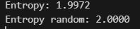

Мета роботи:

Створити модель стаціонарного джерела з пам’яттю 1-го порядку та згенерувати 1000 символів. Виконати аналіз отриманої послідовності та обчислити її ентропію.

Код програми:

import numpy as np
import random
from collections import Counter
import math

def generate_transition_matrix():
    matrix = np.array([[0.4, 0.3, 0.2, 0.1],
                       [0.1, 0.4, 0.3, 0.2],
                       [0.2, 0.1, 0.4, 0.3],
                       [0.3, 0.2, 0.1, 0.4]])
    return matrix

def generate_sequence(matrix, length=1000, alphabet=['A', 'C', 'E', 'G']):
    sequence = [random.choice(alphabet)]
    for _ in range(length - 1):
        prev_index = alphabet.index(sequence[-1])
        next_symbol = random.choices(alphabet, weights=matrix[prev_index])[0]
        sequence.append(next_symbol)
    return ''.join(sequence)

def calculate_entropy(text):
    frequencies = Counter(text)
    total = len(text)
    entropy = -sum((count/total) * math.log2(count/total) for count in frequencies.values())
    return entropy

def calculate_random_entropy(alphabet=['A', 'C', 'E', 'G']):
    uniform_prob = 1 / len(alphabet)
    return -len(alphabet) * uniform_prob * math.log2(uniform_prob)

matrix = generate_transition_matrix()
sequence = generate_sequence(matrix)
entropy = calculate_entropy(sequence)
random_entropy = calculate_random_entropy()

print(f'Sequence: {sequence}')

print(f'Entropy: {entropy:.4f}')
print(f'Entropy random: {random_entropy:.4f}')

Згенерована послідовність:

Sequence: GAACGGCCGAECEGCEGAGAACEGGGAEECCGGCCEECCCCCCEEGCEAEEEAEEEAAACEGGCCEGGAAACAEGCEGGGCEEEGCCCGGCGEAGGAAAACEGGAEGGGCAAAACEAAAAAEACCCGEEEAEGACCGEEGCGCEGACEAGGCCCEEEEEGEGEAACGEGCCGCACCGAGCCEEAEGEAEEGAACCCCGCGCCACCGGGAEEEGCEEECCGCCEEEEGGGGCCAGCEAACCCACCCEACGGEACEACCEEEAAEECCCCCEGGEEGAEEEAAGGACEAACCGGGAACEGACEGCGGGGACECEEGAACCGCEEGEACCGAGAAEAACGAGEECEGEGGEEEEGEAACCGEACCCCEAEEGCCEEGAEECAEECCCEGGAACEEEGAEGGAACCAAACCCECCGGAGAEGGCEEGGCCEGGEAGGGAAAACCGGGEEEGAACCCCCEEACGGCAGCEGGCEEEEEGGCCEGCEAEEGACCEECECACCEGAEGGGGGAAACACCECECGAAACAAGEEEAACGGACEEEGGACACEGEGCGGEGECCGCCCEEGCEEEEEGAACEACAAEEGCAAACCCGEGGGEGGGEEGCCCGGACAAAACEEGGGGCCGAEGGCCGACCCCAACAAEGACEAGAGACEECCEAAACAGCEEAACCCAECEEAACGGACCEECCEEEEEEGCCEAEGGGGACEACCGGACGGACEEACCCEGEEAGACACCEACEGAAEGGGGCCEGGEACEEEGGGCGAACCGEEEEGAAECCCCCGAACCGGGCGCCCCEEAEGGACCEGCEEEGACCEAAAAACEACEGAAAGGEEACGAAAEEGAAACECEGAACCEEEAEACCCCEGGGGEAAAAEGCCGCGAAAEGGGGGGCEGACGGAACGAGEAAEEGCCCCGGAGAAAAECCCEAAEEEEGGCEACCCCEEGAACEEGAAEGAAACAGGGGCCCECCEAAEGGGGGGACEACAGEGCCCCCEEAGEGGGGG

Обчислена ентропія:

 

Висновки:

Для порівняння було розраховано ентропію випадкового джерела без пам’яті, яка є вищою, ніж у джерела з пам’яттю. Це підтверджує, що залежність поточного символу від попереднього зменшує невизначеність системи.