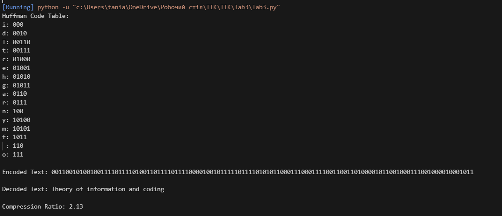

1.Переваги — оптимальне стиснення без втрат. Недоліки — потребує побудови дерева, неефективний для малих обсягів або рівномірних частот.

2.Ефективність зростає при сильному повторенні символів. На однакових частотах ефект мінімальний.

3.Оптимальність — алгоритм мінімізує середню довжину кодового слова, виходячи з частот.

4.Декодування без втрат — завдяки префіксній властивості: жоден код не є префіксом іншого.

