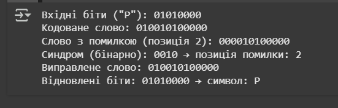

1.Як визначити кількість перевірочних бітів?
Використовуємо нерівність: 2^r ≥ k + r + 1.

2.Як формується синдром?
XOR обчислення по H-матриці → результат — двійкове число, що вказує позицію помилки.

3.Скільки помилок може виявляти/виправляти?
Виявляє 2, виправляє 1 помилку.

4.Чому перевірочні біти — у степенях двійки?
Так кожен біт має унікальне покриття контрольними бітами → синдром точно вказує на позицію.

